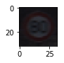

#**Traffic Sign Recognition** 

**Build a Traffic Sign Recognition Project**

The goals / steps of this project are the following:
* Load the data set (see below for links to the project data set)
* Explore, summarize and visualize the data set
* Design, train and test a model architecture
* Use the model to make predictions on new images
* Analyze the softmax probabilities of the new images
* Summarize the results with a written report

## Rubric Points
###Here I will consider the [rubric points](https://review.udacity.com/#!/rubrics/481/view) individually and describe how I addressed each point in my implementation.  

---
###Writeup / README

###Data Set Summary & Exploration

####1. The code for this step is contained in the second code cell of the IPython notebook.  

I used the pandas library to calculate summary statistics of the traffic
signs data set:

* The size of training set is 39209
* The size of test set is 12630
* The shape of a traffic sign image is 32x32x3
* The number of unique classes/labels in the data set is 43

####2. Include an exploratory visualization of the dataset and identify where the code is in your code file.

The code for this step is contained in the third code cell of the IPython notebook.  

###Design and Test a Model Architecture

####1. Preprocessing

The code for this step is contained in the fourth code cell of the IPython notebook.

The images have been converted to grayscale to achive a better output as mentioned in the document.

####2. The code for splitting the data into training and validation sets is contained in the end of fourth code cell of the IPython notebook.  

To cross validate my model, I randomly split the training data into a training set and validation set. I did this by using the shuffule function

My final training set had 25093 number of images. My validation set and test set had 6274 and 12630 number of images.

####3. The code for my final model is located in the fifth cell of the ipython notebook. 

My final model consisted of the following layers:

| Layer         		|     Description	        					| 
|:---------------------:|:---------------------------------------------:| 
| Input         		| 32x32x3 RGB image   							| 
| Convolution 5x5     	| 1x1 stride, same padding, outputs 28x28x6 	|
| RELU					|												|
| Max pooling	      	| 2x2 stride,  outputs 14x14x6 				|
| Convolution 5x5	    | 1x1 stride, outputs 10x10x16      									|
| Max pooling	      	| 2x2 stride,  outputs 5x5x16 				|
| Fully connected		| flattned image of 400 output 128.        									|
| Fully connected		| flattned image of 128 output 84.        									|
| Fully connected		| flattned image of 84 output 10.        									|
| Softmax				| with cross entropy.        									|
|Adam optimizer						| To increase accuracy												
####4. The code for training the model is located in the sixth cell of the ipython notebook. 

To train the model, I used an LeNet layer, with Adam Optimiser. It gives the output accuracy of 96%

####5.  The code for calculating the accuracy of the model is located in the ninth cell of the Ipython notebook.
* LeNet 5 architecture was chosen since it already takes in 32x32 images and is perfect for the use case
* The validation and test accuracy is good , so i believe this is the right model
* The parameters that were tunued were epochs, learning rate , sigma. Tuning these parameters was iterative process and resulted in better training accuracy
* I also used dropout regularization (code commented out) but removed it since it decreased overall accuracy of the training data (accuracy with dropout was just 90.1% as compared to current 97% accuracy)

My final model results were:
* training set accuracy of 96%
* validation set accuracy of 96% 
* test set accuracy of 66.66%

###Test a Model on New Images

####1. Here are five German traffic signs that I found on the web:

 
 
 

 

The last image might be difficult to classify because all the spped limits signs look almost the same

####2. The code for making predictions on my final model is located in the eigth cell of the Ipython notebook.

Here are the results of the prediction:

| Image			        |     Prediction	        					| 
|:---------------------:|:---------------------------------------------:| 
| Bumpy road      		| Bumpy road   									| 
| Slippery Road			| Slippery Road      							|
| No entry     			| No Entry 										|
| General Caution					| General Caution											|
| Children crossing			| Children crossing      							|
| 80 km/h	      		| 120km/h					 				|

The model was able to correctly guess 4 of the 6 traffic signs, which gives an accuracy of 66.66%.

####3. The code for making predictions on my final model is located in the 10th cell of the Ipython notebook.

For the first image, the model is relatively sure that this is a bumpy (probability of 0.6), and the image does contain a stop sign. The top five soft max probabilities were

| Probability         	|     Prediction	        					| 
|:---------------------:|:---------------------------------------------:| 
| 1.0      		| Bumpy road   									| 
| 0.9			| Slippery Road      							|
| 1.0     			| No Entry 										|
| 0.9					| General Caution											|
| 1.0			| Children crossing      							|
| 0.9	      		| 120km/h					 				|

####4. In the 11th cell I have shown a bar graph for that matches probabilities against indices